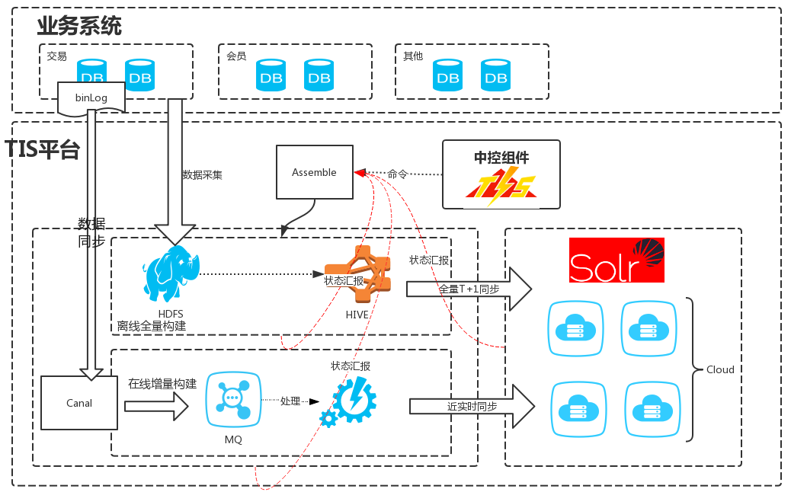

## 产品特性

TIS是一款为用户提供一站式搜索引擎服务的企业化产品，它基于Solr，具有方便、快捷、稳定、易维护的特性。[详细](http://tis.pub/posts/intro-tis)
有以下功能特性:

- 具有版本控制的元数据维护
 
   将solr配置文件(schema.xml,solr.xml等)从Zookeeper中剥离，持久化由TIS托管，并且提供多版本机制，实现索引修改历史查看，回滚等机制。

- 离线式全量索引构建流程

   企业级数据索引数据规模上亿是非常常见的，加之业务中会以多表Join（构建宽表）的方式实现全量数据。在此背景下Solr自带的数据导入插件会有诸多问题，例如导入时间长，导入过程中会影响线上搜索节点的正常查询。因此TIS中独创性的提供了离线全量索引构建的解决方案，实现了海量索引数据快速构建，无缝切换等功能。

- 基于流式计算的数据近实时同步方案

  TIS提供了针对Solr搜索引擎的增量近实时解决方案，实现了数据库中的数据变更秒级同步到Solr搜索引擎中，且TIS已将增量引擎无缝整合到TIS平台中，增量执行过程中的实时状态信息实时同步到TIS控制台中。

- 为行业业务痛点提供模板式解决方案

     搜索引擎在企业级应用场景中被广泛应用。例如，会员营销CRM系统、基于地理位置的O2O实体搜索、基于SKU和SPU的商品系统。这些业务在场景中普有数据量大，搜索查询RT响应时间苛刻，且搜索引擎中的数据需要与数据库中的数据需要近实时同步。基于这样的背景下，基于Solr从零开始搭建企业级搜索引擎会有碰到不少挑战。正因此，TIS团队在以往的项目中已经积累了大量的这方面经验，并且已经将这些惊讶固化到了TIS的产品中，针对这些需求做到了模板化，只需少量设置几个参数就能开箱即用。

- 具有一站式全生命周期控制的控制台界面

  TIS整合了搜索引擎平台的离线、在线、实时、状态监控等诸多模块。用户可以随时通过TIS的控制台，洞悉整个搜索引擎平台的状态作出正确的决策。

## 安装说明

   TIS是基于分布式环境下运行的产品，TIS团队希望安装过程尽量简单，因此为TIS产品安装编写了一个基于基于[Ansible](https://docs.ansible.com/)的安装脚本[https://github.com/qlangtech/tis-ansible](https://github.com/qlangtech/tis-ansible)
   
   安装分为两种模式,[详细安装说明](http://tis.pub/posts/install/):

- 基于源码的安装
  
    如果使用过程中想修改TIS某些代码，那可以修改源码然后编译打包再安装，那可以使用这种安装模式。该安装流程会稍长，请耐心等待。

- 基于Release包的的安装

  TIS会将正式发布版本放在网上的镜像仓库中，执行该安装模式会直接将网上发布的镜像文件拖到本地进行安装。对于初次安装的用户来说比较适用。
  

## 架构

## 许可协议

 TIS is under the MIT license. See the [LICENSE](https://github.com/qlangtech/tis-solr/blob/master/LICENSE) file for details.
