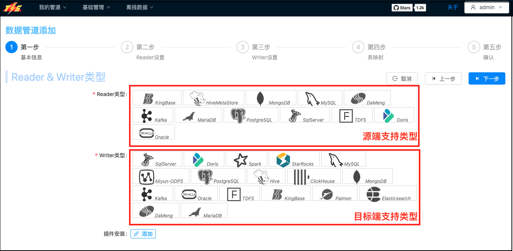

## Stargazers over time

## TIS介绍

TIS为您提供企业级数据集成服务，**基于批(DataX)，流(Flink-CDC、Chunjun)一体，提供简单易用的操作界面，降低用户实施端到端数据同步的实施门槛，缩短任务配置时间，避免配置过程中出错，使数据同步变得简单、有趣且容易上手** [详细介绍](https://tis.pub/docs/)

如果您已经觉得利用DataX、Flink-CDC、SeaTunnel编写脚本来驱动执行端到端数据同步程序执行，是非常烦冗且容易出错的事儿。并因此感到些许厌倦，您可以尝试一下TIS，相信会给您带来不小的惊喜。

## :arrow_forward: 安装说明

快速安装（支持私有云、公有云等环境），方便、快捷 [:green_circle:单机](https://tis.pub/docs/install/tis/uber) [:purple_circle:Docker](https://tis.pub/docs/install/tis/docker) [:large_blue_circle:Docker Compose](https://tis.pub/docs/install/tis/docker-compose) [:brown_circle:K8S](https://tis.pub/docs/install/tis/kubernetes)

##  发布：

最新版本：v4.3.0（2025/8/19) https://github.com/datavane/tis/releases/tag/v4.3.0

**历史发布**：
* v4.2.1 发布（2025/5/1）：https://github.com/datavane/tis/releases/tag/v4.2.1
* v4.1.0 发布（2025/2/2）：https://github.com/datavane/tis/releases/tag/v4.1.0
* v4.0.1 发布（2024/10/19）：https://github.com/datavane/tis/releases/tag/V4.0.1

## 架构

## 核心特性

* :hammer:安装简单

  TIS的安装还是和传统软件安装一样，只需要三个步骤：一、下载tar包，二、解压tar包，三、启动TIS。是的，就这么简单。另外还支持多种部署模式（Docker、Docker-Compose、Kubernetes）。

* :rocket:强大的扩展性

  TIS 继承了Jenkin 的设计思想，使用微前端技术，重新构建了一套前端框架，前端页面可以自动渲染。

  TIS 提供了良好的扩展性和SPI机制，开发者可以很轻松地开发新的插件。

* :repeat:支持各种Transformer算子

  通过在TIS流程中设置Transformer功能逻辑，可实现在ETL数仓功能中，在E（数据抽取）阶段即可高效实现各种字段值转换功能，如：字段脱敏，字段拼接，取子字符串等功能。

* :smile:易与大数据生态整合

  支持与DolphinScheduler整合，用户只需在TIS中配置数据管道，验证无误后，一键推送同步表任务到DolphinScheduler平台，即可在其上完成数据同步任务调度。为以DolphinScheduler构建ETL数仓方案如虎添翼。

* :ok_hand: 基于 DataOps 理念

  借鉴了 DataOps、DataPipeline 理念，对各各执行流程建模。不需要了解底层模块的实现原理，基本实现傻瓜化方式操作。

## 支持的读写组件 [详细](https://tis.pub/docs/plugin/source-sink/)
|Reader|Writer|
|--|--|
|             |      |

## 功能一瞥
- 示例
    * [基于TIS快速实现MySQL到StarRocks的实时数据同步方案](https://tis.pub/docs/example/mysql-sync-starrocks)
    * [多源同步Doris方案](https://tis.pub/docs/example/mysql-sync-doris)
    * [将数据变更同步到Kafka](https://tis.pub/docs/example/sink-2-kafka)
    * [利用TIS实现T+1离线分析](https://tis.pub/docs/example/dataflow)
    * [多源同步Paimon方案](https://tis.pub/docs/example/paimon/)
- 视频示例
    * [安装示例](https://www.bilibili.com/video/BV18q4y1p73B/)
    * [启用分布式执行功能](https://www.bilibili.com/video/BV1Cq4y1D7z4?share_source=copy_web)
    * [MySQL导入ElasticSearch](https://www.bilibili.com/video/BV1G64y1B7wm?share_source=copy_web)
    * [MySQL导入Hive](https://www.bilibili.com/video/BV1Vb4y1z7DN?share_source=copy_web)
    * [MySQL导入Clickhouse](https://www.bilibili.com/video/BV1x64y1B7V8/)
    * [MySQL同步StarRocks](https://www.bilibili.com/video/BV19o4y1M7eq/)
    * MySQL同步Doris [>批量同步](https://www.bilibili.com/video/BV1eh4y1o7yQ) [>实时同步](https://www.bilibili.com/video/BV1nX4y1h7SW)
### 批量导入流程设置

选择Reader/Writer插件类型

添加MySqlReader

设置MySqlReader目标表、列  

设置MySqlReader目标列设置Transformer逻辑。例如，将表中JSON内容的列分拆成多个字段`json_splitter`

添加ElasticWriter,可视化设置ElasticSearch的Schema Mapping

执行MySql->ElasticSearch DataX实例，运行状态

### 开通Flink实时数据通道

添加Flink-Cluster、设置重启策略、CheckPoint机制等

设置Source/Sink组件属性

TIS基于数据库元数据信息自动生成Flink-SQL脚本,您没看错全部脚本自动生！

实时数据通道创建完成！控制台实时显示实时同步流量，并且，可以执行限流，启停（Pause/Resume）等操作[详细](https://tis.pub/docs/guide/rate-controller/)

构建一个实时数仓就这么简单！！！
## 依赖项目

- WEB UI [https://github.com/qlangtech/ng-tis](https://github.com/qlangtech/ng-tis)
- 发版信息生成器[https://github.com/qlangtech/tis-git-manager](https://github.com/qlangtech/tis-git-manager)
- 基于Ansible的打包工具 [https://github.com/qlangtech/tis-ansible](https://github.com/qlangtech/tis-ansible)
- TIS 插件 
   1. [plugins](https://github.com/qlangtech/plugins) 
   2. [tis-plugins-commercial](https://github.com/qlangtech/tis-plugins-commercial)
   3. SqlServer Connector [qlangtech/tis-sqlserver-plugin](https://github.com/qlangtech/tis-sqlserver-plugin)
   4. Paimon Connector [qlangtech/tis-paimon-plugin](https://github.com/qlangtech/tis-paimon-plugin)
- TIS 插件元数据生成工具 [https://github.com/qlangtech/update-center2](https://github.com/qlangtech/update-center2)
- DataX [https://github.com/qlangtech/DataX](https://github.com/qlangtech/DataX)
- Flink Extend [https://github.com/qlangtech/flink](https://github.com/qlangtech/flink)
- Dolphinscheduler [https://github.com/qlangtech/dolphinscheduler](https://github.com/qlangtech/dolphinscheduler)
- TIS 插件功能脚手架 [https://github.com/qlangtech/tis-archetype-plugin](https://github.com/qlangtech/tis-archetype-plugin)
- Chunjun [https://github.com/qlangtech/chunjun](https://github.com/qlangtech/chunjun)
- TIS Docs Manager [https://github.com/qlangtech/tis-doc](https://github.com/qlangtech/tis-doc)
- 扩展Debezium [qlangtech/debezium](https://github.com/qlangtech/debezium)
- 扩展Flink-CDC [qlangtech/flink-cdc](https://github.com/qlangtech/flink-cdc)
- 部分插件参数配置参考 Airbyte [https://github.com/airbytehq/airbyte](https://github.com/airbytehq/airbyte)
- 架构思想参考 [https://github.com/jenkinsci/jenkins](https://github.com/jenkinsci/jenkins)

## 如何开发

[https://tis.pub/docs/develop/compile-running/](https://tis.pub/docs/develop/compile-running/)

## 许可协议

TIS is under the Apache2 License. See the [LICENSE](https://github.com/qlangtech/tis-solr/blob/master/LICENSE) file for details.

## 反馈

您在使用过程中对TIS有任何不满或者批评都请不惜斧正，您提出的宝贵意见是对我们最大的支持和鼓励，[我要提建议](https://github.com/qlangtech/tis/issues/new)
