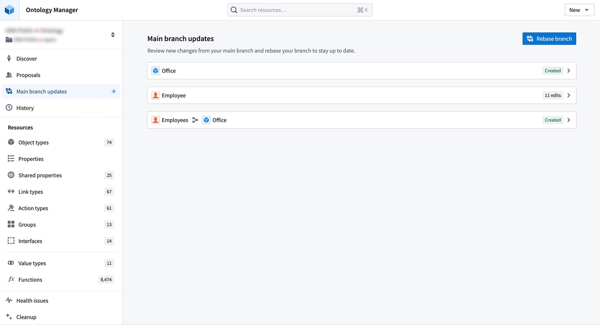
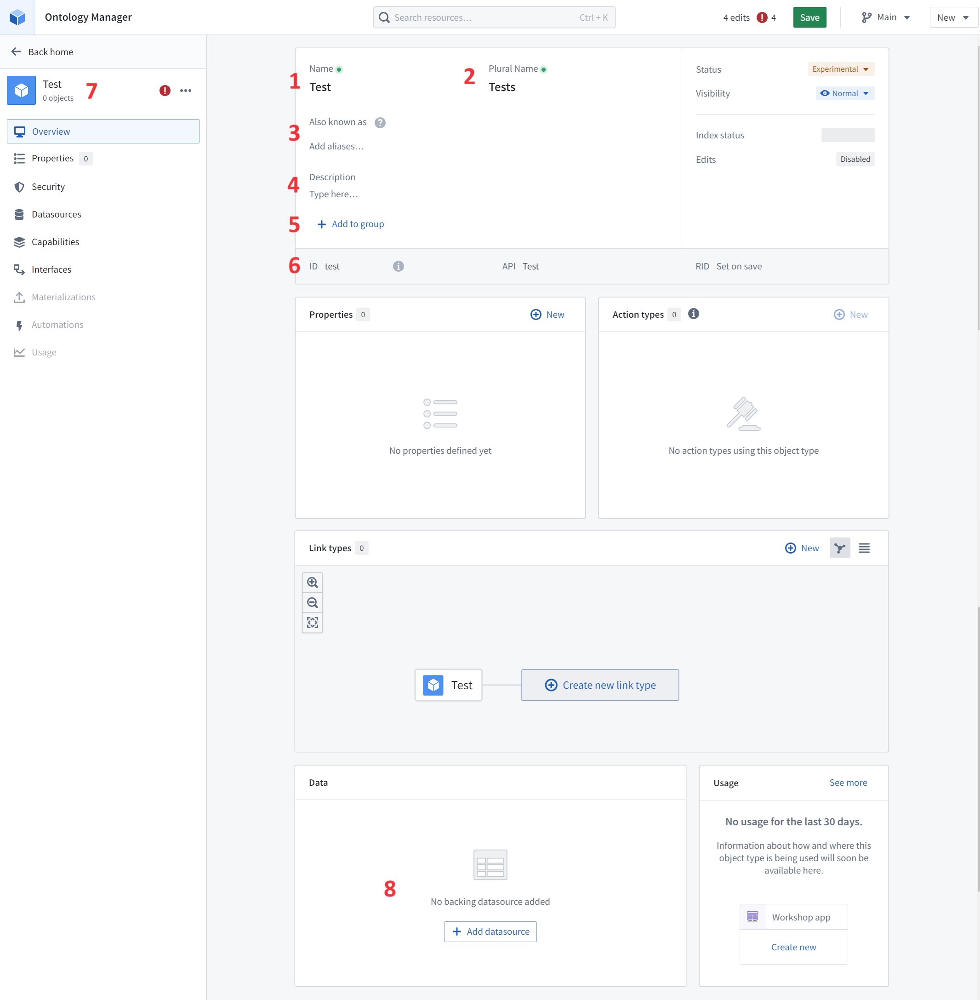
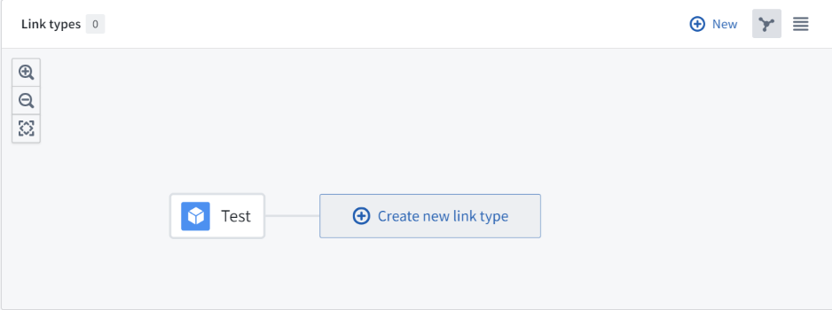


# TIS ontology 设计

## Ontology Domain 页
 这个截图是palantir中的 ontology管理页面，左边是对应ontology的菜单页，右边是点击菜单项随之展示的详情内容。
在前端工程OntologyDetailComponent组件中 /Users/mozhenghua/j2ee_solution/project/tis-console/src/base/ontology.detail.component.ts 实现对应功能
TIS在本版本迭代不需要全部临摹，只需要参照部分功能就行。以下是Resources下需要的功能：
1. Object types：展示在Object types列表中点击其中一个Object type会跳转到`Ontology Object 详情页`
2. Shared Properties
3. Link Types
4. Value Types

**注意**：简单起见，TIS中不需要引入记录修改记录的功能，所以palantir中有关变更分支管理的功能都不需要

## Ontology Object 详情页
需要实现如图所示  的参照palantir 本体详情页面展示。对应前端页面：/Users/mozhenghua/j2ee_solution/project/tis-console/src/base/ontology.object-type.detail.component.ts

### 页面布局
页面布局分为左右两个部分，左边为菜单栏，右边为有关ontology相关的部件展示，要点：
1. 左边的菜单栏：本迭代版本仅需要‘overview’ ， ‘properties’，‘datasources’
2. 右边的ontolog相关的部件展示中，需要保留：
   1. 顶部的profile属性一览
   2. Properies
   3. Link types: 此处需要特别参照palantir的可视化设计 , 每增加一个link type对象，就会增加一个围绕Type object的实体，他们之间需要用实线连接，前端实现建议可以使用Rete.js ✅ （ 专业节点编辑器） 
