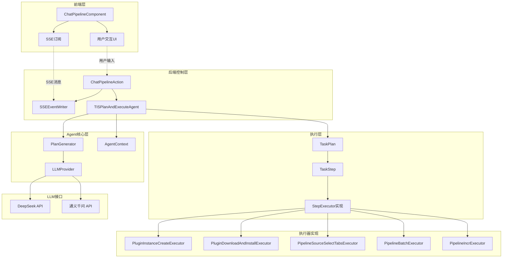
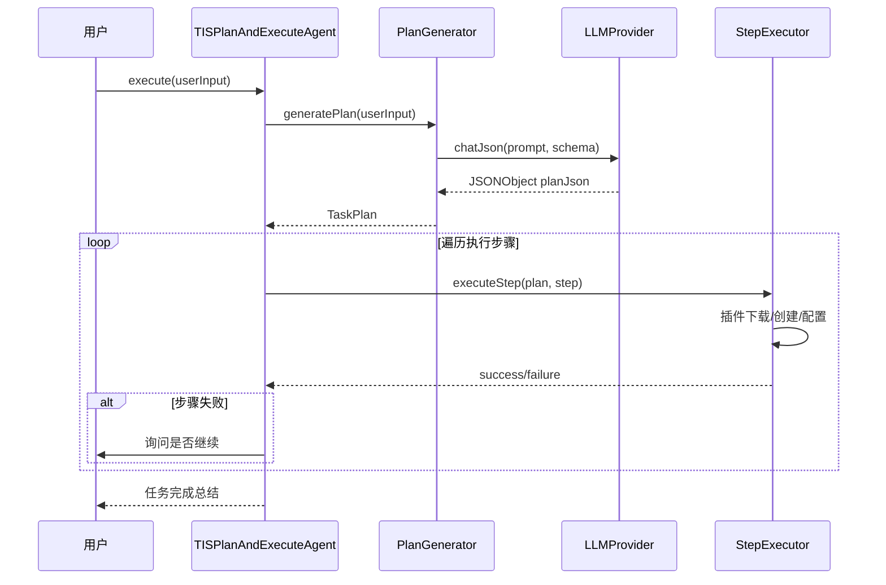
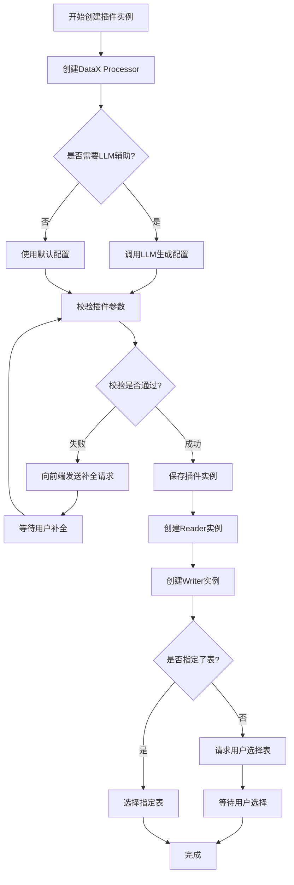
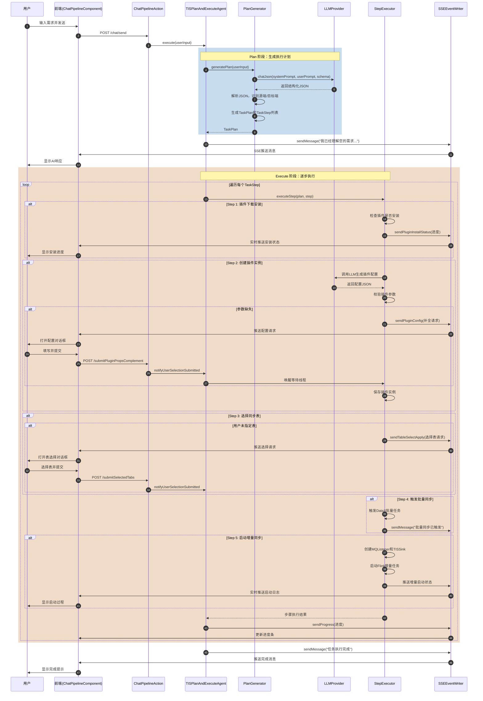
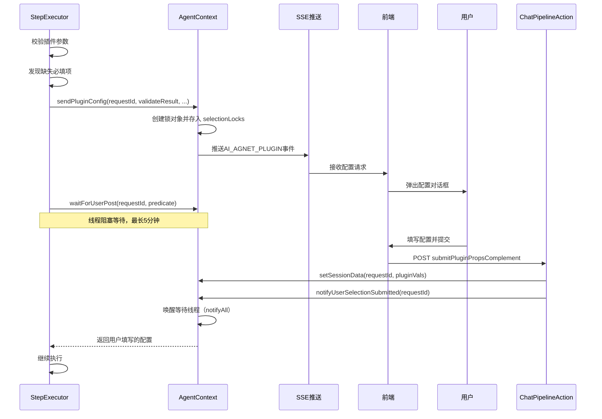
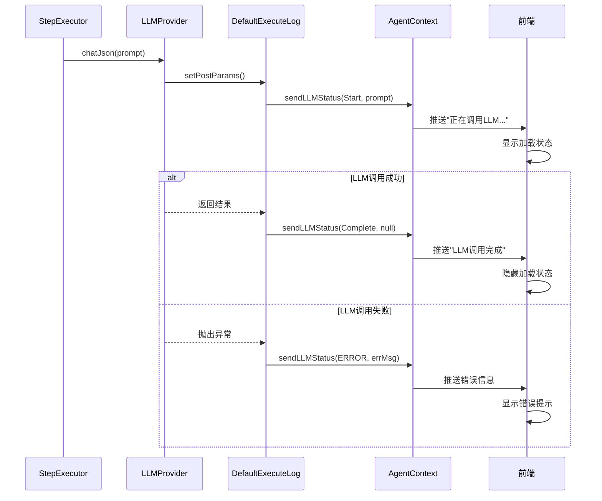

# TIS Pipeline AI Agent 技术实现文档

## 项目概述

TIS Pipeline AI Agent 是国内首个大数据领域的原生 AI Agent 工具，基于 Plan-and-Execute 架构，深度整合 TIS 数据集成平台的插件体系，实现了通过自然语言创建数据同步管道的能力。

**项目特点：**
- 完全自主实现，未使用 dify、n8n 等通用框架
- 深度整合 TIS 领域模型和插件系统
- 支持 DeepSeek、通义千问等国产大模型
- 基于 SSE (Server-Sent Events) 实现实时交互
- 支持批量同步和增量实时同步

## 核心架构

### 整体架构设计



## 核心类说明

### 1. AgentContext - Agent执行上下文

**文件位置：** `tis-console/src/main/java/com/qlangtech/tis/aiagent/core/AgentContext.java`

**核心职责：**
- 管理会话状态（sessionId、sessionData）
- SSE 消息推送（sendMessage、sendError、sendPluginConfig等）
- 用户交互等待机制（waitForUserPost、notifyUserSelectionSubmitted）
- Token 统计和 LLM 状态管理
- 任务取消控制

**关键方法：**

```java
// 发送文本消息到客户端
public void sendMessage(String message, PayloadLink... link)

// 发送插件配置请求，等待用户补全
public void sendPluginConfig(
    RequestKey requestId, 
    AjaxValve.ActionExecResult validateResult,
    IPluginEnum pluginEnum, 
    String pluginImpl, 
    AttrValMap valMap)

// 请求用户选择，支持候选项列表
public void requestUserSelection(
    RequestKey requestId, 
    String prompt,
    Optional<IEndTypeGetter.EndType> endType, 
    List<PluginExtraProps.CandidatePlugin> candidatePlugins)

// 等待用户响应（阻塞式，支持超时）
public <ChatSessionData extends ISessionData> ChatSessionData
  waitForUserPost(RequestKey requestId, Predicate<ChatSessionData> predicate)

// 取消当前任务
public void cancel()
```

**设计亮点：**
- 使用 `ConcurrentHashMap<String, Object>` 管理每个请求的锁对象，支持并发等待
- 超时机制：默认 5 分钟（maxWaitMillis = 300000）
- 支持多种 SSE 事件类型（文本、插件配置、选择请求、进度、错误等）

### 2. TISPlanAndExecuteAgent - 主控制器

**文件位置：** `tis-console/src/main/java/com/qlangtech/tis/aiagent/core/TISPlanAndExecuteAgent.java`

**核心流程：**



**关键方法：**

```java
// 主入口：执行用户任务
public void execute(String userInput)

// 生成任务计划（调用 LLM）
TaskPlan generatePlan(String userInput)

// 执行任务计划
private void executePlan(TaskPlan plan)

// 执行单个步骤
private boolean executeStep(TaskPlan plan, TaskStep step)
```

### 3. PlanGenerator - 任务计划生成器

**文件位置：** `tis-console/src/main/java/com/qlangtech/tis/aiagent/plan/PlanGenerator.java`

**核心职责：**
- 解析 LLM 返回的 JSON 结构
- 识别源端和目标端类型
- 生成标准化的执行步骤

**LLM JSON Schema:**

```json
{
  "intention": "string类型,任务意图（CreatePipeline）",
  "source": {
    "type": "端类型（MySQL、Doris等）",
    "extractInfo": "源端描述信息",
    "tables": "表名称（逗号分隔）"
  },
  "target": {
    "type": "端类型",
    "extractInfo": "目标端描述信息"
  },
  "options": {
    "execute_batch": "boolean,是否触发全量同步",
    "enable_incr": "boolean,是否启动增量同步"
  }
}
```

**生成的标准步骤：**

```java
private void generateGenericPlan(TaskPlan plan, JSONObject llmAnalysis) {
    // Step 1: 检查并安装必要插件
    TaskStep installStep = new TaskStep("检查并安装必要插件", StepType.PLUGIN_INSTALL);
    
    // Step 2: 创建 Reader、Writer 插件实例
    TaskStep readerStep = new TaskStep("创建数据源Reader、Writer插件实例", StepType.PLUGIN_CREATE);
    
    // Step 3: 执行批量数据同步
    TaskStep executeStep = new TaskStep("执行数据同步", StepType.EXECUTE_BATCH);
    
    // Step 4: 增量实时数据同步启动
    TaskStep incrStep = new TaskStep("增量实时数据同步启动", StepType.EXECUTE_INCR);
}
```

### 4. TaskPlan - 任务执行计划

**文件位置：** `tis-console/src/main/java/com/qlangtech/tis/aiagent/plan/TaskPlan.java`

**核心数据结构：**

```java
public class TaskPlan {
    private String planId;                          // 计划唯一标识
    private SourceDataEndCfg sourceEnd;             // 源端配置
    private DataEndCfg targetEnd;                   // 目标端配置
    private List<TaskStep> steps;                   // 执行步骤列表
    private String userInput;                       // 用户原始输入
    private LLMProvider llmProvider;                // LLM 提供者
    
    // 插件扩展点映射
    private Map<Class<? extends Describable>, DescribableImpl> readerExtendPoints;
    private Map<Class<? extends Describable>, DescribableImpl> writerExtendPoints;
}

// 源端配置
public static class SourceDataEndCfg extends DataEndCfg {
    private List<String> selectedTabs;              // 选择的表
    private IAppSource processor;                   // 管道实例
    private boolean executeBatch;                   // 是否触发全量同步
    private boolean executeIncr;                    // 是否启动增量同步
}
```

### 5. StepExecutor 实现 - 步骤执行器

#### 5.1 PluginInstanceCreateExecutor - 插件实例创建

**文件位置：** `tis-console/src/main/java/com/qlangtech/tis/aiagent/execute/impl/PluginInstanceCreateExecutor.java`

**执行流程：**



**核心代码片段：**

```java
@Override
public boolean execute(TaskPlan plan, TaskStep step, AgentContext context) {
    // 1. 创建DataX Processor（管道主体）
    AttrValMap processorVals = createPluginInstance(plan, context, 
        new UserPrompt("正在生成管道主体配置...", plan.getUserInput()),
        Optional.empty(), plan.processorExtendPoints, HeteroEnum.APP_SOURCE, 
        primaryValRewrite);
    
    // 2. 创建 Reader 实例
    DataxReader dataXReader = createPluginAndStore(HeteroEnum.DATAX_READER, plan, 
        Optional.of(sourceEndCfg.getType()), dataXReaderImpl,
        new UserPrompt("正在生成源端配置...", sourceEndCfg.getRelevantDesc()),
        context, primaryValRewrite, ctx, pluginCtx, processMeta);
    
    // 3. 创建 Writer 实例
    DataxWriter dataXWriter = createPluginAndStore(HeteroEnum.DATAX_WRITER, plan, 
        Optional.of(targetEndCfg.getType()), dataXWriterImpl,
        new UserPrompt("正在生成目标端配置...", targetEndCfg.getRelevantDesc()),
        context, primaryValRewrite, ctx, pluginCtx, processMeta);
    
    // 4. 选择同步表
    if (CollectionUtils.isNotEmpty(sourceEnd.getSelectedTabs())) {
        // 用户明确指定了表
        tabs = dataXReader.createDefaultTables(pluginCtx, sourceEnd.getSelectedTabs(), ...);
    } else {
        // 请求用户选择
        RequestKey requestId = RequestKey.create();
        context.sendTableSelectApply(requestId, "请选择需要同步的表", primaryFieldVal, dataXReaderImpl);
        selectApplySessionData = context.waitForUserPost(requestId, predicate);
    }
}
```

#### 5.2 PluginDownloadAndInstallExecutor - 插件下载安装

**核心逻辑：**

```java
@Override
public boolean execute(TaskPlan plan, TaskStep step, AgentContext context) {
    // 1. 检查所有扩展点的插件实现
    plan.checkDescribableImplHasSet();
    
    // 2. 收集需要下载的插件
    List<UpdateCenter.Plugin> needToInstallPlugins = collectNeedToInstallPlugins(plan);
    
    if (needToInstallPlugins.isEmpty()) {
        context.sendMessage("所有必要插件已安装");
        return true;
    }
    
    // 3. 批量下载并安装
    List<UpdateCenter.UpdateCenterJob> installJobs = 
        needToInstallPlugins.stream()
            .map(plugin -> plugin.deploy(true))
            .collect(Collectors.toList());
    
    // 4. 实时推送安装状态
    RequestKey requestKey = RequestKey.create();
    while (hasRunningJobs(installJobs)) {
        context.sendPluginInstallStatus(requestKey, installJobs, false);
        Thread.sleep(1000);
    }
    
    context.sendPluginInstallStatus(requestKey, installJobs, true);
    return true;
}
```

#### 5.3 PipelineBatchExecutor - 批量数据同步

```java
@Override
public boolean execute(TaskPlan plan, TaskStep step, AgentContext context) {
    if (!plan.getSourceEnd().isExecuteBatch()) {
        context.sendMessage("用户未要求触发批量数据同步，跳过");
        return true;
    }
    
    // 触发批量同步
    DataxAction.doExecuteWorkflow(primaryFieldVal.identityValue(), context);
    
    context.sendMessage("批量数据同步任务已触发");
    return true;
}
```

#### 5.4 PipelineIncrExecutor - 增量实时同步

```java
@Override
public boolean execute(TaskPlan plan, TaskStep step, AgentContext context) {
    if (!sourceEnd.isExecuteIncr()) {
        return true;
    }
    
    // 1. 创建 MQListenerFactory（源端实时监听）
    createPluginAndStore(HeteroEnum.MQ, plan, Optional.of(sourceEnd.getType()), 
        mqListenerImpl, ...);
    
    // 2. 创建 TISSinkFactory（目标端实时写入）
    createPluginAndStore(HeteroEnum.INCR_STREAM_SCRIPT, plan, 
        Optional.of(targetEnd.getType()), tisSinkImpl, ...);
    
    // 3. 启动增量任务
    launchIncrTask(context, primaryFieldVal.identityValue());
    
    return true;
}
```

## 前端实现

### ChatPipelineComponent - 聊天界面组件

**文件位置：** `/Users/mozhenghua/j2ee_solution/project/tis-console/src/runtime/chat.pipeline.component.ts`

**核心功能：**

1. **SSE 订阅机制**

```typescript
// 建立 SSE 连接
connectSSE(sessionId: string): void {
    const eventSource = new EventSource(`/api/sse/${sessionId}`);
    
    // 订阅不同类型的事件
    eventSource.addEventListener('AI_AGNET_MESSAGE', (e) => {
        this.handleTextMessage(JSON.parse(e.data));
    });
    
    eventSource.addEventListener('AI_AGNET_PLUGIN', (e) => {
        this.handlePluginConfigRequest(JSON.parse(e.data));
    });
    
    eventSource.addEventListener('AI_AGNET_SELECTION_REQUEST', (e) => {
        this.handleSelectionRequest(JSON.parse(e.data));
    });
    
    eventSource.addEventListener('AI_AGNET_PLUGIN_INSTALL_STATUS', (e) => {
        this.handlePluginInstallStatus(JSON.parse(e.data));
    });
}
```

2. **用户交互处理**

```typescript
// 发送消息
sendMessage(): void {
    if (!this.inputText || !this.selectedProviderId) return;
    
    // 添加用户消息到会话
    this.currentSession.messages.push({
        role: 'user',
        type: 'text',
        content: this.inputText
    });
    
    // 发送到后端
    this.tisService.httpPost('/api/chat/send', {
        sessionId: this.currentSession.id,
        message: this.inputText,
        providerId: this.selectedProviderId
    }).subscribe((result) => {
        if (result.success) {
            this.isProcessing = true;
            this.connectSSE(this.currentSession.id);
        }
    });
}

// 打开插件配置对话框
openPluginDialog(msg: ChatMessage): void {
    PluginsComponent.openPluginDialog({
        saveBtnLabel: '确认',
        shallLoadSavedItems: false,
        item: msg.pluginData.item,
        savePluginEventCreator: () => {
            return this.createSavePluginEvent(msg.requestId);
        }
    }, this, msg.pluginData.desc, {name: 'noStore', require: true},
    msg.pluginData.desc.displayName, (event, biz) => {
        // 插件保存成功，通知后端
        this.submitPluginPropsComplement(msg.requestId, event);
    });
}

// 提交用户选择
submitSelection(msg: ChatMessage): void {
    this.tisService.httpPost('/api/chat/submitSelection', {
        requestId: msg.requestId,
        selectedIndex: msg.selectionData.selectedIndex
    }).subscribe((result) => {
        if (result.success) {
            msg.resolved = true;
        }
    });
}
```

3. **倒计时机制**

```typescript
// 为需要用户响应的消息添加倒计时
startMessageCountdown(msg: ChatMessage): void {
    msg.countdownStartTime = Date.now();
    msg.countdownDuration = this.applyUserInputMaxWaitMillis; // 5分钟
    
    const interval = setInterval(() => {
        const elapsed = Date.now() - msg.countdownStartTime;
        const remaining = msg.countdownDuration - elapsed;
        
        if (remaining <= 0 || msg.resolved) {
            clearInterval(interval);
            if (!msg.resolved) {
                msg.timeout = true;
            }
        }
    }, 1000);
}
```

## 主要执行流程

### 完整执行流程图



### 关键交互时序

#### 1. 插件配置补全流程



#### 2. LLM 调用状态推送流程



## SSE 事件类型

| 事件类型 | 说明 | 数据格式 |
|---------|------|---------|
| `AI_AGNET_MESSAGE` | 普通文本消息 | `{type: 'text', content: '...', payloadLink: {...}}` |
| `AI_AGNET_ERROR` | 错误消息 | `{type: 'error', message: '...', payloadLink: {...}}` |
| `AI_AGNET_PROGRESS` | 进度更新 | `{type: 'progress', task: '...', current: 1, total: 10}` |
| `AI_AGNET_TOKEN` | Token消耗统计 | `{type: 'token', count: 1234}` |
| `AI_AGNET_PLUGIN` | 插件配置请求 | `{type: 'plugin', impl: '...', config: {...}, requestId: '...'}` |
| `AI_AGNET_SELECTION_REQUEST` | 用户选择请求 | `{type: 'selection_request', prompt: '...', options: [...], requestId: '...'}` |
| `AI_AGNET_SELECT_TABLE` | 选择表请求 | `{requestId: '...', dataxName: '...', content: '...', dataXReaderDesc: {...}}` |
| `AI_AGNET_PLUGIN_INSTALL_STATUS` | 插件安装状态 | `{requestId: '...', installJobs: [...], complete: true}` |
| `AI_AGNET_LLM_CHAT_STATUS` | LLM调用状态 | `{status: 'Start\|Complete\|ERROR', detail: '...'}` |

## 核心数据结构

### DescribableImpl - 插件描述符实现

```java
public class DescribableImpl {
    private final Class<? extends Describable> extendPoint;  // 扩展点类型
    private final Optional<IEndTypeGetter.EndType> endType;  // 端类型（可选）
    private List<Descriptor> impls;                          // 该扩展点的实现列表
    
    // 添加实现
    public DescribableImpl addImpl(String implClass) {
        Descriptor desc = TIS.get().getDescriptor(implClass);
        this.impls.add(desc);
        return this;
    }
    
    // 获取唯一实现（如果只有一个）
    public Descriptor getImplDesc() {
        if (impls.size() == 1) {
            return impls.get(0);
        }
        throw new IllegalStateException("Multiple implementations found");
    }
}
```

### RequestKey - 请求标识符

```java
public class RequestKey {
    private final String sessionKey;
    
    public static RequestKey create() {
        return new RequestKey("req_" + System.currentTimeMillis() + "_" + UUID.randomUUID());
    }
    
    public String getSessionKey() {
        return sessionKey;
    }
}
```

### ISessionData - 会话数据接口

```java
public interface ISessionData {
    // 是否已有用户响应
    boolean hasUserResponse();
}

// 插件配置补全数据
public class PluginPropsComplement implements ISessionData {
    private final AttrValMap originalValMap;
    private AttrValMap complementedValMap;
    
    @Override
    public boolean hasUserResponse() {
        return complementedValMap != null;
    }
}

// 用户选择数据
public class SelectionOptions implements ISessionData {
    private List<CandidatePlugin> candidates;
    private Integer selectedIndex;
    
    @Override
    public boolean hasUserResponse() {
        return selectedIndex != null && selectedIndex >= 0;
    }
}

// 表选择数据
public class TableSelectApplySessionData implements ISessionData {
    private List<String> selectedTabs;
    
    @Override
    public boolean hasUserResponse() {
        return CollectionUtils.isNotEmpty(selectedTabs);
    }
}
```

## 技术亮点

### 1. 智能参数补全机制

当 LLM 生成的插件配置缺少必填参数时，系统能够：
- 自动识别缺失的字段
- 生成用户友好的表单界面
- 支持嵌套插件的配置补全
- 保留用户历史配置

### 2. 阻塞式等待 + 超时机制

```java
public <T extends ISessionData> T waitForUserPost(RequestKey requestId, Predicate<T> predicate) {
    Object lock = selectionLocks.computeIfAbsent(requestId.getSessionKey(), k -> new Object());
    
    synchronized (lock) {
        long startTime = System.currentTimeMillis();
        
        while (!cancelled) {
            T sessionData = getSessionData(requestId);
            if (predicate.test(sessionData)) {
                sessionData.remove(requestId.getSessionKey());
                return sessionData;
            }
            
            long remainingTime = maxWaitMillis - (System.currentTimeMillis() - startTime);
            if (remainingTime <= 0) {
                throw TisException.create("操作已经超时");
            }
            
            lock.wait(remainingTime);  // 阻塞等待或超时
        }
    }
    
    return null;
}
```

### 3. 插件能力自动匹配

系统根据端类型（EndType）自动匹配对应的插件实现：

```java
// TaskPlan 构造函数中自动构建扩展点映射
this.readerExtendPoints = ImmutableMap.of(
    DataxReader.class, new DescribableImpl(DataxReader.class, Optional.of(sourceEnd.getType())),
    MQListenerFactory.class, new DescribableImpl(MQListenerFactory.class, Optional.of(sourceEnd.getType()))
);

this.writerExtendPoints = ImmutableMap.of(
    DataxWriter.class, new DescribableImpl(DataxWriter.class, Optional.of(targetEnd.getType())),
    TISSinkFactory.class, new DescribableImpl(TISSinkFactory.class, Optional.of(targetEnd.getType()))
);
```

### 4. 任务取消机制

用户可随时取消正在执行的任务：

```java
// AgentContext.cancel()
public void cancel() {
    this.cancelled = true;
    
    // 唤醒所有等待的线程
    for (Object lock : selectionLocks.values()) {
        synchronized (lock) {
            lock.notifyAll();
        }
    }
    selectionLocks.clear();
}

// TISPlanAndExecuteAgent.executePlan()
for (TaskStep step : plan.getSteps()) {
    if (context.isCancelled()) {
        context.sendMessage("任务已被取消");
        break;
    }
    // 执行步骤...
}
```

## 扩展点

### 如何添加新的 StepExecutor

1. 继承 `BasicStepExecutor` 抽象类
2. 实现 `execute(TaskPlan plan, TaskStep step, AgentContext context)` 方法
3. 在 `TaskStep` 中注册执行器

```java
public class CustomStepExecutor extends BasicStepExecutor {
    @Override
    public boolean execute(TaskPlan plan, TaskStep step, AgentContext context) {
        // 自定义执行逻辑
        context.sendMessage("正在执行自定义步骤...");
        
        // 调用 LLM 辅助（可选）
        LLMProvider.LLMResponse response = plan.getLLMProvider().chat(
            context,
            new UserPrompt("提示信息", "用户输入"),
            systemPrompts
        );
        
        // 请求用户交互（可选）
        RequestKey requestId = RequestKey.create();
        context.requestUserSelection(requestId, "请选择选项", candidates);
        SelectionOptions selection = context.waitForUserPost(requestId, predicate);
        
        return true;
    }
}
```

### 如何添加新的端类型支持

1. 在 `IEndTypeGetter.EndType` 枚举中添加新端类型
2. 实现对应的 Reader/Writer 插件
3. 系统会自动识别并集成

## 性能优化

1. **插件懒加载**：只在需要时才下载和安装插件
2. **并发安装**：多个插件并行下载安装
3. **缓存机制**：已安装插件不重复下载
4. **流式推送**：使用 SSE 实时推送进度，避免轮询

## 未来规划

基于 `tis-ai-agent-enhancement-proposal.md` 中的通用化架构改进方案，未来将实现：

1. **能力抽象层**：
   - PluginCapability（插件能力） - 物理层
   - AtomicCapability（原子能力） - 逻辑层
   - CompositeCapability（复合能力） - 业务层

2. **能力组合器（Capability Composer）**：
   - 根据用户意图动态识别所需能力
   - 自动检查能力兼容性和依赖关系
   - 生成可执行的任务计划

3. **扩展场景支持**：
   - 数据质量管理
   - 数据血缘分析
   - 智能运维助手

---

**文档版本：** v1.0  
**作者：** 百岁  
**最后更新：** 2025-11-20
